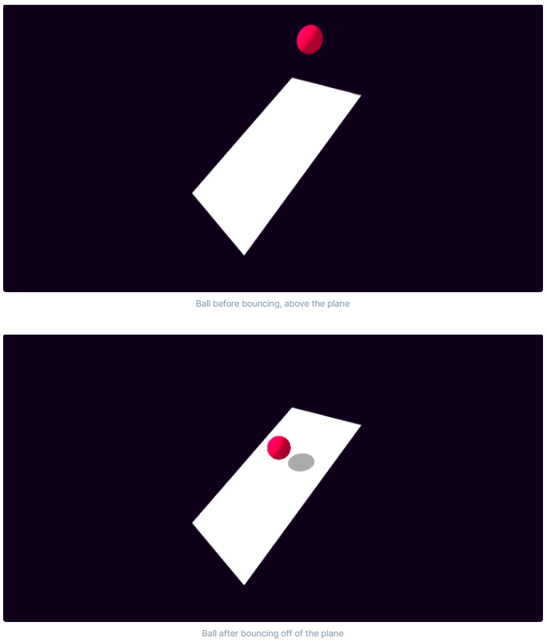

# 3.2 Usability Testing

## Criteria To Assess

| Test               | Test Details                                                                                         |
| ------------------ | ---------------------------------------------------------------------------------------------------- |
| 1 - Effective      | Does the game make you want to play it more? Is it enjoyable to play? Does it relieve stress?        |
| 2 - Efficient      | Are menus easy to navigate? Are the controls intuitive and / or easy to learn?                       |
| 3 - Engaging       | Is the game enjoyable? Do you want to play it more than once? Would you recommend it to a friend?    |
| 4 - Error Tolerant | Are there any bugs? Does the game crash easily? Is the FPS good/consistent?                          |
| 5 - Easy to Learn  | Are the controls intuitive or easy to learn? How difficult is it to understand the goal of the game? |

Listed below are the results of the questions. I will go over the results in depth during the evaluation

## User Feedback

### Effective

#### Question 1

<figure><figcaption></figcaption></figure>

The results from this question were not as positive as I had hoped for, with a majority only somewhat agreeing and most people only being neutral or less. I think this has been caused by the lack of graphical complexity in the game. With textures of the car and other objects only consisting of basic shapes.

#### Question 2

<figure><figcaption></figcaption></figure>

Respondents all found the game enjoyable. This means that it was complex enough and robust.

### Efficient

#### Question 3

<figure><figcaption></figcaption></figure>

An overwhelming majority of respondents thought that the menus were very easy to navigate. This means that my game should be able to be played by a wide sector of society, something I set out to achieve in [1.4a-features-of-the-proposed-solution.md](../1-analysis/1.4a-features-of-the-proposed-solution.md "mention").

#### Question 4

<figure><figcaption></figcaption></figure>

All respondents agreed that the controls were easy or intuitive to learn. This is another accessibility feature that I set out to include in [1.4a-features-of-the-proposed-solution.md](../1-analysis/1.4a-features-of-the-proposed-solution.md "mention").

### Engaging

#### Question 5

<figure><figcaption></figcaption></figure>

While a few people would not be likely to recommend the game to a friend, a majority of respondents would. This shows that I have created an enjoyable game that people would share.

### Error tolerant

#### Question 6

<figure><figcaption></figcaption></figure>

The majority of people found no bugs with the game. This is good as it means that most people's gaming experience will not be interrupted by unwanted bugs. The few bugs that people ran into were not game breaking enough for it to matter.

#### Question 7

<figure><figcaption></figcaption></figure>

This shows that my game's FPS should never drop below 60. This matches one of my criteria in[1.5-success-criteria.md](../1-analysis/1.5-success-criteria.md "mention").

### Easy to learn

#### Question 8

<figure><figcaption></figcaption></figure>

All respondents were in agreement that the game was not difficult to understand. This means that anyone can play my game and relatively quickly get an understanding of what they were meant to do.

## Usability Requirements in Success Criteria

Some of the success criteria requirements fall into the section of usability. These will also be tested now and are listed below:

| Criterion | Description                               |
| --------- | ----------------------------------------- |
| 5         | The game should be accessible to everyone |
| 22        | Controls should be sensible and common    |
| 26        | Menu should be easily navigated           |

### Criterion 5

I was able to show my game off to a range of people who were using different types of devices. I could also get the game to run on mobile while still maintaining roughly the same performance. This shows that it can be played on any device that the user wants.

### Criterion 22

<figure><figcaption></figcaption></figure>

All users at least somewhat agreed that the controls were easy or intuitive, this means that criterion 22 has been met.

### Criterion 26

<figure><figcaption></figcaption></figure>

A large majority of players strongly agreed that the menus were usefully designed which means that criterion 26 has been sufficiently met.
